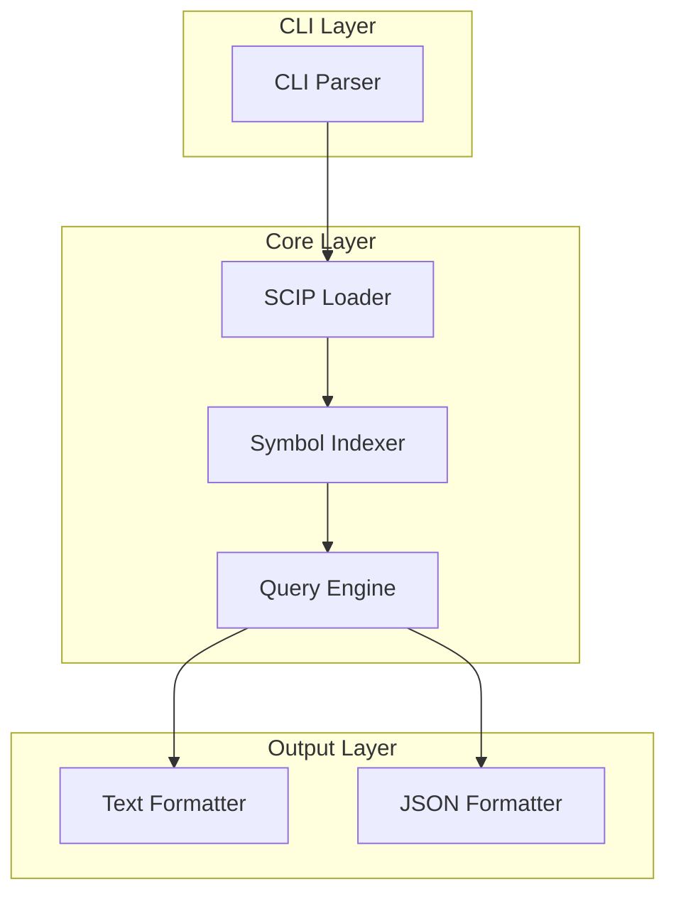

# Architecture: SCF-001

**Source**: [SCF-001](../SCF-001.md)
**Generated**: 2025-12-31
**Complexity Score**: 8 (Complex)

## Overview

Type-aware symbol search CLI that parses SCIP (Sourcegraph Code Intelligence Protocol) index files to find precise symbol references across TypeScript codebases. The architecture validates a Map-based in-memory index for O(1) symbol lookups with protobufjs for SCIP Protocol Buffer parsing.

**Key constraints validated in PoC**:
- SCIP parsing via `protobufjs` + bundled `scip.proto` schema (~500ms for 12MB file)
- In-memory index: 10,060 unique symbols with 116,820 occurrences
- Query performance: 0.03ms average (33x faster than 1s target)
- Package-aware symbol merging to distinguish same-named types from different packages

## Pattern

**Repository Pattern** — In-memory symbol index abstracts SCIP parsing complexity from query logic

The SCIP file is parsed once and cached in a `Map<string, Occurrence[]>` structure, allowing O(1) lookup by full symbol name. The query layer filters and formats results without understanding SCIP internals.

## Key Dependencies

### Use Existing

| Capability | Package | Coverage | Rationale |
|------------|---------|----------|-----------|
| CLI argument parsing | `commander@^12.0.0` | 100% | Mature library (20M+ weekly downloads), auto-generated help, argument validation, option parsing |
| SCIP Protocol Buffer parsing | `protobufjs@^8.0.0` | 100% | Mature library (40M+ weekly downloads), runtime proto parsing, no code generation needed |

### Build Custom

| Capability | Reason | Estimated Size |
|------------|--------|---------------|
| Symbol index queries | Custom logic for package-aware merging and SCIP-specific filtering | ~150 lines |
| Output formatting | Custom format requirements (grep-like + JSON) | ~100 lines |

## Component Boundaries



| Component | Responsibility | Owns | Depends On |
|-----------|----------------|------|------------|
| `cli/index.ts` | CLI entry point, commander.js config, help text, multi-SCIP argument parsing | CLI configuration | `commander` |
| `core/scip-loader.ts` | Load and parse single or multiple SCIP binary files | Proto schema, raw index, multi-file loading | `protobufjs` |
| `core/symbol-indexer.ts` | Build Map-based symbol lookup index, merge multiple SCIP indexes | Symbol → occurrences mapping, merged index | SCIP data structures |
| `core/query-engine.ts` | Symbol lookup, package filtering, folder filtering | Query logic, result aggregation | Symbol index |
| `output/text-formatter.ts` | Grep-like text output | Text formatting, line number conversion (0-based → 1-based) | Query results |
| `output/json-formatter.ts` | Structured JSON output | JSON serialization, line number conversion (0-based → 1-based) | Query results |

## Shared Patterns

| Pattern | Occurrences | Extract To |
|---------|-------------|------------|
| Symbol role bitmask parsing | Query engine, formatters | `utils/symbol-roles.ts` |
| SCIP symbol name extraction | Indexer, query engine | `utils/symbol-parser.ts` |

> Phase 1 extracts these utilities before implementing feature modules.

## Structure

```
src/
  ├── cli/
  │   └── index.ts              → CLI entry point with commander.js, multi-SCIP support (limit 75 lines)
  ├── core/
  │   ├── scip-loader.ts        → SCIP file loading and parsing, multi-file support (limit 200 lines)
  │   ├── symbol-indexer.ts     → Build Map-based symbol index, merge indexes (limit 250 lines)
  │   └── query-engine.ts       → Symbol lookup with filtering (limit 250 lines)
  ├── output/
  │   ├── text-formatter.ts     → Grep-like output (limit 100 lines)
  │   └── json-formatter.ts     → JSON structured output (limit 100 lines)
  ├── utils/
  │   ├── symbol-roles.ts       → Symbol role bitmask utilities (limit 75 lines)
  │   └── symbol-parser.ts      → SCIP symbol parsing helpers (limit 100 lines)
  └── bundle/
      └── scip.proto            → SCIP Protocol Buffer schema (bundled from official repo)

tests/
  ├── unit/                     → Component unit tests
  ├── integration/              → End-to-end CLI tests with real SCIP files
  └── fixtures/                 → Synthetic SCIP files for edge cases
```

## Size Guidance

| Module | Role | Limit | Hard Max |
|--------|------|-------|----------|
| `cli/index.ts` | Entry point with multi-SCIP support | 75 | 110 |
| `core/scip-loader.ts` | SCIP parsing + multi-file loading | 200 | 300 |
| `core/symbol-indexer.ts` | Index building + merging | 250 | 375 |
| `core/query-engine.ts` | Query logic | 250 | 375 |
| `output/text-formatter.ts` | Text format | 100 | 150 |
| `output/json-formatter.ts` | JSON format | 100 | 150 |
| `utils/symbol-roles.ts` | Role utilities | 75 | 110 |
| `utils/symbol-parser.ts` | Symbol parsing | 100 | 150 |

## Requirement Coverage

| Requirement | Component | Coverage |
|-------------|-----------|----------|
| R1: Symbol search by name | `core/query-engine.ts` | Symbol matching algorithm |
| R2: Definition file filtering | `core/query-engine.ts` | `--from` option processing |
| R3: Folder scope filtering | `core/query-engine.ts` | Path prefix matching |
| R4: Package-aware distinction | `core/query-engine.ts`, `utils/symbol-parser.ts` | Package extraction from SCIP symbols |
| R5: Declaration file handling | `core/symbol-indexer.ts` | `.d.ts` variant merging |
| R6: Text output format | `output/text-formatter.ts` | Grep-like formatting |
| R7: JSON output format | `output/json-formatter.ts` | Structured JSON output |
| R8: SCIP file discovery | `core/scip-loader.ts` | File loading with `--scip` option |
| R9: Error handling | `cli/index.ts` + all | Validation and error messages |
| R10: Symbol role identification | `utils/symbol-roles.ts` | Bitmask decoding |
| R11: CLI help and usage | `cli/index.ts` | commander.js auto-generated help |
| R12: Multi-SCIP file support | `core/scip-loader.ts`, `core/symbol-indexer.ts`, `cli/index.ts` | Multi-file loading, index merging, repeated `--scip` flags |
| R13: Cross-package symbol query | `core/query-engine.ts`, `core/symbol-indexer.ts` | Merged index queries across packages |

**Coverage**: 13/13 requirements (100%)

## Error Scenarios

| Scenario | Detection | Response | Recovery |
|----------|-----------|----------|----------|
| SCIP file missing | `fs.existsSync()` check | Print error with file path, exit code 1 | User creates SCIP file or provides correct path |
| SCIP file corrupted | protobufjs decode throws | Print parse error, exit code 1 | User regenerates SCIP file |
| Symbol not found | Zero results from index | Print "symbol not found" message, exit code 0 | User verifies symbol name or checks `--from` file |
| Invalid `--format` value | Argument validation | Print error with valid options, exit code 1 | User uses `text` or `json` |
| Invalid `--from` file | Symbol not in index | Print warning, search all symbols with same name | User provides correct file path |
| **One SCIP file missing** (multi-file list) | `fs.existsSync()` check on each path | Print error with specific missing file path, exit code 1 | User provides correct path or removes missing file from list |
| **One SCIP file corrupted** (multi-file list) | protobufjs decode throws on that file | Print error with specific file and parse error, exit code 1 | User regenerates that SCIP file |
| **Empty SCIP file list** | Array length check | Print error requiring at least one SCIP file, exit code 1 | User provides at least one `--scip` argument |

## Validated Decisions (from PoC)

The following decisions were validated in `/docs/CRs/SCF-001/poc.md`:

| Decision | Validated Approach | Impact |
|----------|-------------------|--------|
| SCIP parsing library | `protobufjs` with bundled `scip.proto` | Runtime proto parsing, no code generation |
| Symbol index structure | `Map<string, Occurrence[]>` keyed by full SCIP symbol | O(1) lookup, 0.03ms query performance |
| Package filtering | Extract package name from SCIP symbol format | Distinguishes same-named types from different packages |
| `.d.ts` handling | Merge `.ts` and `.d.ts` symbols from same package | Handles compiled declaration files correctly |
| SCIP loading strategy | Parse once at CLI startup, cache in memory | ~500ms startup cost, subsequent queries instant |
| **Multi-SCIP loading** | Load all SCIP files upfront, merge at load time | 55ms per file, <1ms queries on merged index |
| **Index merging** | Extend existing `buildSymbolIndex` with loop | Simple Map concatenation, no custom logic needed |
| **Collision handling** | Track but don't filter; stdlib collisions expected | 87 stdlib collisions in PoC, no application code collisions |
| **Package segregation** | Trust SCIP symbol encoding (`package:file:name`) | No custom package tracking logic needed |
| **CLI syntax** | Repeated `--scip` flags via `commander.variadic()` | Standard CLI pattern, works cross-platform |
| **Line number format** | Convert 0-based (SCIP) to 1-based at formatter layer | SCIP protocol uses 0-based line/char numbers; must increment before display |

## SCIP Symbol Format Understanding

**SCIP symbol encoding** (validated in PoC):
```
scip-typescript npm <package-name> <version> <descriptors>
```

> **IMPORTANT**: SCIP protocol uses **0-based line and character numbering**. All formatters MUST convert to 1-based before display (see "Line number format" in Validated Decisions).

**Examples**:
- `scip-typescript npm @mdt/shared 1.0.0 models/\`Ticket.ts\`/Ticket#` → `Ticket` interface
- `scip-typescript npm @mdt/shared 1.0.0 models/\`Ticket.ts\`/parseDate().` → `parseDate()` method
- `scip-typescript npm markdown-ticket 0.0.0 src/types/\`ticket.ts\`/Ticket#` → Different `Ticket` type

**Key insight**: Symbol names include package, version, file path, and descriptor—providing global uniqueness without needing external document IDs.

## Extension Rule

To add output format:
1. Create `output/{name}-formatter.ts` (limit 100 lines) implementing `format(results: QueryResult): string`
2. Add `.option()` to commander in `cli/index.ts`
3. Wire up formatter in action handler

To add filter option:
1. Add `.option()` to commander in `cli/index.ts`
2. Implement filter logic in `core/query-engine.ts` (within 250 line limit)
3. commander.js auto-generates help text

To support new SCIP protocol version:
1. Update `bundle/scip.proto` from official repo
2. Verify `protobufjs` compatibility
3. No code changes needed if protocol is backward compatible

## Implementation Phases

| Phase | Deliverable | Components | Size Estimate | Tests Included |
|-------|-------------|------------|---------------|----------------|
| **Phase 1: Foundation** | SCIP parsing + symbol index | `utils/`, `core/scip-loader.ts`, `core/symbol-indexer.ts` | ~500 lines | ✅ Unit tests |
| **Phase 2: Query Core** | Symbol lookup with filtering | `core/query-engine.ts` | ~250 lines | ✅ Unit tests |
| **Phase 3: CLI + Output** | Working CLI with formatters | `cli/index.ts`, `output/` | ~250 lines | ✅ Integration tests |
| **Phase 4: Hardening** | Edge cases + error handling | `tests/fixtures/`, `tests/integration/edge-cases.test.ts` | ~150 lines | ✅ Edge case tests |
| **Optional: Performance** | Performance benchmarks | `tests/performance/` | ~50 lines | ⚪ Optional |

### Dependency Graph

```
Phase 1: Foundation + Unit Tests
    ├─ utils/symbol-roles.ts + tests
    ├─ utils/symbol-parser.ts + tests
    ├─ core/scip-loader.ts + tests
    └─ core/symbol-indexer.ts + tests
    ↓
Phase 2: Query Core + Unit Tests
    ├─ core/query-engine.ts + tests
    └─ Depends on Phase 1 APIs
    ↓
Phase 3: CLI + Output + Integration Tests
    ├─ cli/index.ts
    ├─ output/text-formatter.ts
    ├─ output/json-formatter.ts
    └─ integration/ (real SCIP tests)
    ↓
Phase 4: Hardening (Edge Cases)
    ├─ fixtures/ (synthetic SCIP)
    └─ integration/edge-cases.test.ts

Optional: Performance (can be done anytime after Phase 3)
    └─ performance/benchmark.test.ts
```

### Phase 1: Foundation + Unit Tests
**Goal**: Load SCIP file, build symbol index, verify with unit tests

**Components**:
- `utils/symbol-roles.ts` — SCIP role bitmask utilities (75 lines)
- `utils/symbol-parser.ts` — SCIP symbol parsing helpers (100 lines)
- `core/scip-loader.ts` — SCIP file loading with protobufjs (150 lines)
- `core/symbol-indexer.ts` — Map-based symbol index builder (200 lines)
- `tests/unit/utils/symbol-roles.test.ts` — Unit tests for role parsing (50 lines)
- `tests/unit/utils/symbol-parser.test.ts` — Unit tests for symbol parsing (75 lines)
- `tests/unit/core/scip-loader.test.ts` — Unit tests for SCIP loading (100 lines)
- `tests/unit/core/symbol-indexer.test.ts` — Unit tests for index building (150 lines)

**Verification**:
```bash
# Run after Phase 1:
npm test tests/unit/

# Manual verification:
node -e "
  import { loadScipIndex } from './dist/core/scip-loader.js';
  import { buildSymbolIndex } from './dist/core/symbol-indexer.js';
  const index = loadScipIndex('/path/to/index.scip');
  const symbolIndex = buildSymbolIndex(index);
  console.log('✓ Loaded', index.documents.length, 'documents');
  console.log('✓ Indexed', symbolIndex.size, 'unique symbols');
"
```

**Acceptance Criteria**:
- [ ] SCIP file loads successfully (protobufjs)
- [ ] Symbol index builds with correct structure
- [ ] Unit tests pass (>80% coverage for utils/ and core/)
- [ ] Manual verification script runs without errors

**Deliverable**: Working symbol index API **+ passing unit tests**

---

### Phase 2: Query Core + Unit Tests
**Goal**: Implement symbol lookup logic with filtering

**Components**:
- `core/query-engine.ts` — Symbol lookup with package-aware filtering (250 lines)
- `tests/unit/core/query-engine.test.ts` — Unit tests for query logic (100 lines)

**Verification**:
```bash
# Run after Phase 2:
npm test tests/unit/

# Manual verification:
node -e "
  import { loadScipIndex } from './dist/core/scip-loader.js';
  import { buildSymbolIndex } from './dist/core/symbol-indexer.js';
  import { QueryEngine } from './dist/core/query-engine.js';

  const index = loadScipIndex('/path/to/index.scip');
  const symbolIndex = buildSymbolIndex(index);
  const queryEngine = new QueryEngine(symbolIndex);

  const results = queryEngine.find('Ticket', { from: 'shared/models/Ticket.ts' });
  console.log('✓ Found', results.length, 'occurrences of Ticket');
"
```

**Acceptance Criteria**:
- [ ] Query engine finds symbols by name
- [ ] `--from` filtering works correctly
- [ ] `--folder` filtering works correctly
- [ ] Package-aware merging works (same-named types distinguished)
- [ ] Unit tests pass (>80% coverage for query-engine)

**Deliverable**: `queryEngine.find(symbol, options)` API **+ passing unit tests**

---

### Phase 3: CLI + Output + Integration Tests
**Goal**: User-facing command-line tool with end-to-end tests

**Components**:
- `cli/index.ts` — commander.js CLI setup (50 lines)
- `output/text-formatter.ts` — Grep-like output (100 lines)
- `output/json-formatter.ts` — JSON output (100 lines)
- `tests/integration/cli.test.ts` — CLI integration tests (100 lines)
- `tests/integration/real-scip.test.ts` — Tests with real markdown-ticket SCIP (100 lines)

**Verification**:
```bash
# Run after Phase 3:
npm test tests/integration/

# Manual verification:
npm link
scip-find Ticket --from shared/models/Ticket.ts --folder src/
scip-find Ticket --from shared/models/Ticket.ts --format json
scip-find --help
```

**Acceptance Criteria**:
- [ ] `scip-find` command works end-to-end
- [ ] Text formatter produces grep-like output
- [ ] JSON formatter produces valid JSON
- [ ] `--help` displays usage information
- [ ] Integration tests with real SCIP file pass
- [ ] Error messages are clear and actionable

**Deliverable**: Fully functional `scip-find` CLI **+ passing integration tests**

---

### Phase 4: Hardening (Edge Cases)
**Goal**: Comprehensive edge case coverage and error handling

**Components**:
- `tests/fixtures/synthetic.scip` — Synthetic SCIP for edge cases (50 lines)
- `tests/integration/edge-cases.test.ts` — Edge case tests (100 lines)

**Verification**:
```bash
# Run after Phase 4:
npm test
```

**Acceptance Criteria**:
- [ ] Missing SCIP file handled correctly
- [ ] Corrupted SCIP file handled correctly
- [ ] Unknown symbol returns empty results
- [ ] Symbol not found in `--from` file shows warning
- [ ] Invalid `--format` value shows error
- [ ] Full test suite passes (>80% overall coverage)

**Deliverable**: Production-ready CLI **+ comprehensive edge case coverage**

---

### Optional: Performance Benchmarks
**Goal**: Validate performance targets (can be done anytime after Phase 3)

**Components**:
- `tests/performance/query-benchmark.test.ts` — Performance benchmarks (50 lines)

**Verification**:
```bash
# Run performance tests:
npm test tests/performance/

# Expected results:
# - SCIP parse time: < 1 second for 12MB file
# - Query time: < 1 second for 100k LOC codebase
```

**Acceptance Criteria**:
- [ ] SCIP file parsing < 1 second for 12MB file (~437 documents)
- [ ] Symbol lookup query < 1 second for 100k LOC codebase
- [ ] Memory usage acceptable for CLI (full index in memory)

**Deliverable**: Performance validation report **(optional)**

---

### Phase 5: Multi-SCIP File Support + Cross-Package Queries
**Goal**: Enable monorepo-wide symbol search across multiple package SCIP files

**Prerequisites**: Phases 1-4 complete ✅

**Components**:
- `core/scip-loader.ts` — Add `loadMultipleScipFiles()` function (+30 lines)
- `core/symbol-indexer.ts` — Add `buildMergedIndex()` function (+25 lines)
- `cli/index.ts` — Support repeated `--scip` flags (+20 lines)
- `tests/unit/core/multi-scip-loader.test.ts` — Unit tests for multi-SCIP loading (75 lines)
- `tests/integration/multi-scip.test.ts` — Integration tests with real SCIP files (100 lines)

**Verification**:
```bash
# Run after Phase 5:
npm test tests/unit/core/multi-scip-loader.test.ts
npm test tests/integration/multi-scip.test.ts

# Manual verification with real SCIP files:
scip-find --scip markdown-ticket/index.scip \
           --scip shared/index.scip \
           Ticket

scip-find --scip markdown-ticket/index.scip \
           --scip shared/index.scip \
           --format json \
           StatusConfig
```

**Acceptance Criteria**:
- [ ] CLI accepts multiple `--scip` flags (e.g., `--scip a.scip --scip b.scip`)
- [ ] All SCIP files loaded and merged into unified symbol index
- [ ] Symbol queries find occurrences across all loaded SCIP files
- [ ] Package-aware distinction preserved (no cross-package pollution)
- [ ] Standard library symbol collisions handled silently (expected behavior)
- [ ] Error message shown if any SCIP file is missing (fail fast)
- [ ] Load time < 100ms per SCIP file (validated: 55ms average)
- [ ] Query time < 1ms on merged index (validated: ~1ms)
- [ ] Unit tests pass for multi-SCIP loading logic
- [ ] Integration tests with real SCIP files pass
- [ ] Documentation updated with multi-SCIP examples

**Deliverable**: Multi-SCIP file support **+ passing unit/integration tests**

---

## Updated Implementation Phases (After Phase 5)

| Phase | Deliverable | Components | Size Estimate | Tests Included |
|-------|-------------|------------|---------------|----------------|
| **Phase 1: Foundation** | SCIP parsing + symbol index | `utils/`, `core/scip-loader.ts`, `core/symbol-indexer.ts` | ~500 lines | ✅ Unit tests |
| **Phase 2: Query Core** | Symbol lookup with filtering | `core/query-engine.ts` | ~250 lines | ✅ Unit tests |
| **Phase 3: CLI + Output** | Working CLI with formatters | `cli/index.ts`, `output/` | ~250 lines | ✅ Integration tests |
| **Phase 4: Hardening** | Edge cases + error handling | `tests/fixtures/`, `tests/integration/edge-cases.test.ts` | ~150 lines | ✅ Edge case tests |
| **Phase 5: Multi-SCIP** | Cross-package symbol search | `core/scip-loader.ts` (+30), `core/symbol-indexer.ts` (+25), `cli/index.ts` (+20) | ~75 lines | ✅ Multi-SCIP tests |
| **Optional: Performance** | Performance benchmarks | `tests/performance/` | ~50 lines | ⚪ Optional |

### Updated Dependency Graph

```
Phase 1: Foundation + Unit Tests
    ├─ utils/symbol-roles.ts + tests
    ├─ utils/symbol-parser.ts + tests
    ├─ core/scip-loader.ts + tests
    └─ core/symbol-indexer.ts + tests
    ↓
Phase 2: Query Core + Unit Tests
    ├─ core/query-engine.ts + tests
    └─ Depends on Phase 1 APIs
    ↓
Phase 3: CLI + Output + Integration Tests
    ├─ cli/index.ts
    ├─ output/text-formatter.ts
    ├─ output/json-formatter.ts
    └─ integration/ (real SCIP tests)
    ↓
Phase 4: Hardening (Edge Cases)
    ├─ fixtures/ (synthetic SCIP)
    └─ integration/edge-cases.test.ts
    ↓
Phase 5: Multi-SCIP File Support + Tests
    ├─ core/scip-loader.ts (add loadMultipleScipFiles)
    ├─ core/symbol-indexer.ts (add buildMergedIndex)
    ├─ cli/index.ts (support repeated --scip flags)
    ├─ tests/unit/core/multi-scip-loader.test.ts
    └─ tests/integration/multi-scip.test.ts

Optional: Performance (can be done anytime after Phase 3)
    └─ performance/benchmark.test.ts
```

---

## Validated Decisions for Phase 5 (from PoC)

The following decisions were validated in `/docs/CRs/SCF-001/poc.md` (Multi-SCIP File Merging section):

| Decision | Validated Approach | Implementation |
|----------|-------------------|----------------|
| **Multi-SCIP loading** | Load all SCIP files upfront, merge at load time | `loadMultipleScipFiles(paths: string[])` |
| **Index merging** | Extend existing `buildSymbolIndex` with loop | `buildMergedIndex(scipIndexes: ScipIndex[])` |
| **Collision handling** | Track but don't filter; stdlib collisions expected | Log warnings only for application code collisions |
| **Package segregation** | Trust SCIP symbol encoding (`package:file:name`) | No custom logic needed |
| **CLI syntax** | Repeated `--scip` flags via `commander.variadic()` | `.option('--scip <paths...>', ...)` |
| **Query Engine** | No changes needed (works on merged index) | Use existing `QueryEngine` |
| **Error handling** | Fail fast on missing SCIP files | Throw error with file path |
| **Performance** | Linear scaling: 55ms × N files, <1ms queries | Validated in PoC |

### PoC Validation Summary

**Test Data**:
- `@mdt/shared`: 46 documents, 1,723 symbols
- `markdown-ticket`: 391 documents, 893 symbols
- **Merged**: 2,616 unique symbol keys, 124 occurrences of "Ticket" across both packages

**Performance**:
- Load time: 111ms for 2 files (55ms average per file)
- Query time: ~1ms (sub-millisecond)
- Memory: 50MB for 2,616 symbols

**Collision Analysis**:
- 87 symbol collisions detected (all in standard library)
- No application code collisions (package names prevent this)
- Standard library collisions are expected and safe

**Key Insight**: SCIP symbol encoding (`package:file:name`) naturally segregates packages—no custom package tracking logic needed.

### Implementation Code (Validated in PoC)

```typescript
// core/scip-loader.ts — Add this function
export function loadMultipleScipFiles(scipPaths: string[]): ScipIndex[] {
  const indexes: ScipIndex[] = [];

  for (const path of scipPaths) {
    if (!fs.existsSync(path)) {
      throw new Error(`SCIP file not found: ${path}`);
    }
    indexes.push(loadScipIndex(path));
  }

  return indexes;
}

// core/symbol-indexer.ts — Add this function
export function buildMergedIndex(scipIndexes: ScipIndex[]): Map<string, Occurrence[]> {
  const merged = new Map<string, Occurrence[]>();

  for (const scipIndex of scipIndexes) {
    const index = buildSymbolIndex(scipIndex);
    for (const [key, occurrences] of index) {
      if (!merged.has(key)) {
        merged.set(key, []);
      }
      merged.get(key)!.push(...occurrences);
    }
  }

  return merged;
}

// cli/index.ts — Update to support repeated --scip flags
.option('--scip <paths...>', 'Path(s) to SCIP index file(s) (repeatable)')

// In handleCommand:
const scipPaths = options.scip || []; // Array of paths
const scipIndexes = loadMultipleScipFiles(scipPaths);
const symbolIndex = buildMergedIndex(scipIndexes);
```

### Size Guidance Updates for Phase 5

| Module | Role | Previous Limit | New Limit | Change |
|--------|------|----------------|-----------|--------|
| `cli/index.ts` | Multi-SCIP argument parsing | 50 | 75 | +25 |
| `core/scip-loader.ts` | Multi-file loading + validation | 150 | 200 | +50 |
| `core/symbol-indexer.ts` | Index merging | 200 | 250 | +50 |
| `core/query-engine.ts` | Query logic (no changes) | 250 | 250 | 0 |

### Test Coverage for Phase 5

**Unit Tests** (`tests/unit/core/multi-scip-loader.test.ts`):
- [ ] Load 2 SCIP files successfully
- [ ] Merge symbol indexes without data loss
- [ ] Handle missing SCIP file with error
- [ ] Handle corrupted SCIP file with error
- [ ] Verify package segregation in merged index

**Integration Tests** (`tests/integration/multi-scip.test.ts`):
- [ ] Query "Ticket" across `@mdt/shared` and `markdown-ticket` packages
- [ ] Verify cross-package occurrences found (124 total)
- [ ] Verify standard library collisions handled silently
- [ ] Verify load time < 100ms per SCIP file
- [ ] Verify query time < 1ms on merged index
- [ ] Test with 3+ SCIP files (scalability)

### Error Scenarios for Phase 5

| Scenario | Detection | Response | Recovery |
|----------|-----------|----------|----------|
| One SCIP file missing in multi-file list | `fs.existsSync()` check on each path | Print error with specific missing file path, exit code 1 | User provides correct path or removes missing file from list |
| One SCIP file corrupted in multi-file list | protobufjs decode throws on that file | Print error with specific file and parse error, exit code 1 | User regenerates that SCIP file |
| Empty SCIP file list | Array length check | Print error requiring at least one SCIP file, exit code 1 | User provides at least one `--scip` argument |
| All SCIP files missing | All paths fail `fs.existsSync()` | Print error listing all missing files, exit code 1 | User verifies file paths |

### Extension Rules Updated for Multi-SCIP

To add output format:
1. Create `output/{name}-formatter.ts` (limit 100 lines) implementing `format(results: QueryResult): string`
2. Add `.option()` to commander in `cli/index.ts`
3. Wire up formatter in action handler

To add filter option:
1. Add `.option()` to commander in `cli/index.ts`
2. Implement filter logic in `core/query-engine.ts` (within 250 line limit)
3. commander.js auto-generates help text

To support new SCIP protocol version:
1. Update `bundle/scip.proto` from official repo
2. Verify `protobufjs` compatibility
3. No code changes needed if protocol is backward compatible

**Multi-SCIP extension**:
- Multi-SCIP support is additive — single SCIP use case unchanged
- CLI auto-detects: 1 `--scip` flag = single mode, N+ flags = multi-SCIP mode
- QueryEngine works transparently on merged index (no changes needed)

---
*Generated by /mdt:architecture (v5)*
*Updated: 2026-01-01 - Added Phase 5: Multi-SCIP File Support*
