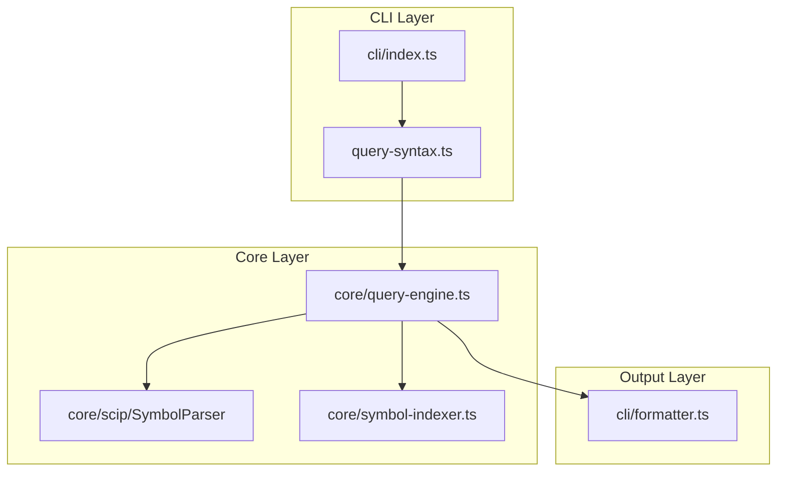

# Architecture: SCF-004

**Source**: [SCF-004](./SCF-004.md)
**Generated**: 2026-01-04
**Complexity Score**: 7 (Complex)
**Mode**: Feature Enhancement (Prep Complete)

## Overview

Extends scip-finder with suffix-aware symbol parsing and syntax-based auto-detection for property and method queries. The architecture adds a lightweight query syntax parser at the CLI boundary and integrates suffix filtering into the existing query engine, maintaining backward compatibility through wildcard suffix matching as the default.

**Key Constraints:**
- Zero breaking changes — existing queries must work unchanged
- Suffix filtering occurs at index level (no post-processing overhead)
- Auto-detection based on intuitive code syntax (`prop` vs `method()`)
- Prep work completed: `core/scip/` module extracted with `SuffixType` enum

## Approach

**Parse query syntax at CLI boundary, pass filter type to query engine.** Simple function-based approach: `detectQuerySyntax()` returns `SuffixType | undefined`, query engine filters by that value.

**Why this fits:**
- CLI is already parsing user input — natural place for syntax detection
- Query engine already has filtering logic (from, folder) — suffix is just another filter
- No inheritance or interfaces needed — just a value passed through
- Easy to test in isolation

## Component Boundaries



| Component | Responsibility | Owns | Depends On |
|-----------|----------------|------|------------|
| `cli/index.ts` | CLI entry point, commander.js setup, help text | Command routing, error handling | `query-syntax.ts`, `QueryEngine` |
| `cli/query-syntax.ts` | Parse query syntax, detect suffix type, strip parameters | Syntax detection logic, parameter stripping | `SuffixType` enum |
| `core/query-engine.ts` | Symbol lookup with suffix filtering | Query execution, index-level filtering | `SymbolIndex`, `SuffixType` |
| `core/scip/SuffixType.ts` | SCIP suffix type enumeration (from prep) | Suffix type constants | — |
| `core/scip/SymbolParser.ts` | Parse SCIP symbol strings with suffix extraction | Symbol parsing, suffix preservation | `SuffixType` |
| `core/symbol-indexer.ts` | Build index with suffix-aware keys | Index map generation | `SymbolParser` |
| `cli/formatter.ts` | Format query results (text/JSON) | Output rendering | — |

## Key Dependencies

**No external dependencies added** — all custom implementation.

| Capability | Approach | Rationale |
|------------|----------|-----------|
| Syntax detection | Custom implementation (~60 lines) | Simple string parsing, no library overhead |
| Suffix filtering | Custom (~40 lines in query engine) | Integrates with existing index lookup |
| Parameter stripping | Custom (~20 lines) | Regex-based, minimal complexity |

## Shared Utilities

| Function | Purpose | Location |
|----------|---------|----------|
| `detectQuerySyntax()` | Parse query string, return suffix type | `cli/query-syntax.ts` |
| `stripMethodParameters()` | Remove `(...)` from method queries | `cli/query-syntax.ts` |

> Extract these first — they're pure functions with no dependencies.

## Structure

```
src/
  ├── cli/
  │   ├── index.ts                 → CLI entry point (add help examples)
  │   ├── query-syntax.ts          → NEW: Syntax detection logic (60 lines)
  │   └── formatter.ts             → Unchanged
  ├── core/
  │   ├── query-engine.ts          → ADD: suffix filtering capability (+40 lines)
  │   ├── scip-loader.ts           → Unchanged
  │   ├── symbol-indexer.ts        → UPDATE: Use suffix-aware keys (prep done)
  │   └── scip/
  │       ├── SuffixType.ts        → FROM PREP: Suffix enum
  │       ├── SymbolParser.ts      → FROM PREP: Symbol parsing
  │       └── SymbolIndexKey.ts    → FROM PREP: Key value object
```

## Size Guidance

| Module | Role | Limit | Hard Max | Notes |
|--------|------|-------|----------|-------|
| `cli/query-syntax.ts` | Feature | 60 | 90 | Syntax detection + parameter stripping |
| `core/query-engine.ts` | Feature | 290 | 435 | Current 250 + suffix filtering |
| `cli/index.ts` | Orchestration | 113 | 170 | Baseline 88 + help examples |

**Total Impact**: ~100 new lines (60 syntax + 40 filtering + examples)

## Extension Rule

To add a new query syntax:
1. Add detection logic to `detectQuerySyntax()` in `cli/query-syntax.ts` (limit 60 lines total)
2. Extend `SuffixFilter` type if new suffix type needed
3. Update `--help` text in `cli/index.ts` with examples

## Requirement Coverage

| Requirement | Component | Notes |
|-------------|-----------|-------|
| R1.1-R1.5 (Suffix preservation) | `SymbolParser.ts` (from prep) | Already implemented in prep phase |
| R2.1-R2.4 (Suffix filtering) | `query-engine.ts` | Add filter parameter to `QueryOptions`, filter in `find()` |
| R3.1-R3.6 (CLI auto-detection) | `cli/query-syntax.ts` | New module for syntax parsing |
| R4.1-R4.3 (Backward compatibility) | All query artifacts | Wildcard default in `SuffixFilter` |
| R5.1-R5.4 (Edge case handling) | `cli/query-syntax.ts`, `query-engine.ts` | Parameter stripping, nested detection |
| FR-1, FR-2 (Suffix extraction/preservation) | `SymbolParser.ts` (prep complete) | ✅ Done |
| FR-3, FR-6 (Filtering logic) | `query-engine.ts` | Add `suffixFilter` to `QueryOptions` |
| FR-4, FR-5 (Auto-detection) | `cli/query-syntax.ts` | NEW module |
| FR-7 (Backward compatibility) | Default behavior | Wildcard match (undefined filter) |
| NFR-U3 (Documentation) | `cli/index.ts`, `README.md` | Add property/method examples |

**Coverage**: 100% — all requirements have component assignments

## Domain Alignment

| Domain Concept | Implementation | Notes |
|----------------|----------------|-------|
| `QueryEngine` (root) | `core/query-engine.ts` | Entry point, owns suffix filtering logic |
| `SuffixFilter` (parameter) | `core/query-engine.ts` | Add `suffixFilter?: SuffixType` to `QueryOptions` |
| `QueryOptions` (value) | `core/query-engine.ts` | EXTEND: Add `suffixFilter?: SuffixType` field |
| Invariant: "Query syntax determines suffix filter type" | `cli/query-syntax.ts` | Enforced at CLI boundary |
| Invariant: "Wildcard default preserves backward compatibility" | `query-engine.ts` | Undefined `suffixFilter` matches all types |

## Implementation Sequence

### Phase 1: Shared Utilities (Extract First)
1. Create `cli/query-syntax.ts` (60 lines)
   - `detectQuerySyntax(query: string): SuffixType | undefined`
   - `stripMethodParameters(query: string): string`
   - Export `SuffixFilter` type

### Phase 2: Query Engine Enhancement
2. Extend `core/query-engine.ts` (+40 lines)
   - Add `suffixFilter?: SuffixType` to `QueryOptions` interface
   - Filter results by suffix in `find()` method
   - Handle undefined filter as wildcard (all types)

### Phase 3: CLI Integration
3. Update `cli/index.ts` (+25 lines)
   - Import `detectQuerySyntax` and `stripMethodParameters`
   - Parse query before passing to `QueryEngine`
   - Update help text with property/method examples

### Phase 4: Testing & Documentation
4. Add unit tests for `query-syntax.ts`
5. Add integration tests for suffix filtering
6. Update `README.md` with property/method examples

## Error Scenarios

| Scenario | Detection | Response | Recovery |
|----------|-----------|----------|----------|
| Invalid suffix type in query | Syntax parser returns `undefined` | Wildcard match (both types) | Graceful degradation |
| SCIP index missing suffix | Lookup key has no suffix | Wildcard match (all types) | Backward compatible |
| Malformed method syntax | `stripMethodParameters()` handles edge cases | Return base name or original query | Best-effort parsing |

## Testing Strategy

**Unit Tests:**
- `query-syntax.ts`: All syntax patterns, edge cases, parameter stripping
- `query-engine.ts`: Suffix filtering logic with all suffix types

**Integration Tests:**
- CLI with real SCIP index containing properties/methods
- Backward compatibility (existing queries unchanged)
- Combined filters (`--from` + suffix detection)

**Snapshot Tests:**
- `scip-finder MyThing.myProp` → only properties
- `scip-finder MyThing.method()` → only methods
- `scip-finder process` → both types (wildcard)

---
*Generated by /mdt:architecture*
